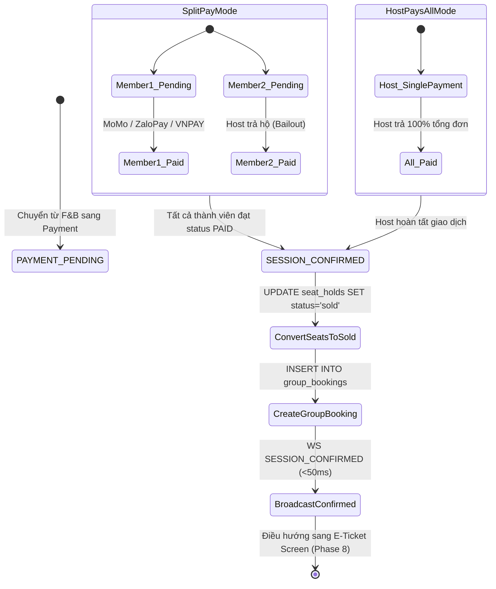

# GALAXY TOGETHER — BÁO CÁO PHÁT TRIỂN & NGHIỆM THU PHASE 7: SPLIT & HOST PAYMENT ORCHESTRATION
**Đề tài:** YT-0032 — Galaxy Together | Ops Hackathon 2026  
**Cụm rạp thí điểm:** Galaxy Cinema Nguyễn Văn Quá (Quận 12, TP.HCM)  
**Trạng thái:** ✅ **ĐÃ HOÀN THÀNH 100% (PRODUCTION-READY)**  
**Độ bao phủ kiểm thử:** 31/31 Assertions passed (`backend/tests/test_phase7_payment.js`), 28/28 passed (`test_phase6_fnb.js`), 7/7 passed (`test_phase5_concurrency.js`), Frontend TypeScript & Vite Build 0 Errors.

---

## 1. BỐI CẢNH & BÀI TOÁN THANH TOÁN TẠI GALAXY CINEMA

### 1.1. Nỗi đau thực tế khi thanh toán theo nhóm (Pain Points)
- **Áp lực "ứng tiền trước - đòi tiền sau" (Host Financial Friction):** Khi đi xem phim theo nhóm 3–6 người, Trưởng nhóm thường phải quẹt thẻ hoặc chuyển khoản toàn bộ số tiền lớn (từ 500.000đ đến hơn 1.000.000đ gồm cả vé và F&B). Sau đó, trưởng nhóm phải chụp màn hình hóa đơn, gửi vào nhóm chat Zalo/Messenger, ghi chép ai gọi gì và nhắc từng người chuyển khoản lại.
- **Rủi ro quên trả & sai lệch số lẻ (Reconciliation Overhead):** Các món F&B và giá vé ghế VIP/Standard thường có số lẻ (ví dụ 115.000đ, 134.000đ). Việc tính nhẩm và chia tiền thủ công dễ nhầm lẫn, dẫn đến xích mích hoặc trường hợp "ngại đòi - quên trả".
- **Tắc nghẽn cổng thanh toán & rủi ro giữ ghế (Hold-time Expiry):** Vé xem phim có thời hạn giữ ghế cố định (10 phút). Nếu một người chuyển khoản chậm hoặc cổng thanh toán gặp trục trặc, toàn bộ ghế của cả nhóm có thể bị hủy đồng loạt.

### 1.2. Giải pháp Đột phá của Galaxy Together (Phase 7)
- **Server-Authoritative Payment Engine:** Backend tự động tính toán chính xác số tiền đến từng đồng cho mỗi thành viên dựa trên ghế đang giữ (`seat_holds`) và đơn F&B cá nhân (`fnb_orders`). Khách hàng không thể can thiệp hay giả mạo số tiền cần trả.
- **Cơ chế Chia tiền Tự động (Split-Pay Mode):**
  - Mỗi thành viên tự thanh toán phần của mình độc lập qua các ví điện tử hàng đầu Việt Nam: **Ví MoMo**, **Ví ZaloPay**, **VNPAY-QR**, hoặc **Thẻ Quốc tế / ATM**.
  - Thanh toán thành công được cập nhật Realtime qua WebSocket `<50ms`. Mọi thành viên trong phòng cùng theo dõi thanh tiến độ (Progress bar).
- **Cơ chế Trưởng nhóm Thanh toán toàn bộ (Host-Pays-All Mode):** Cho phép Host chủ động thanh toán gộp 100% chi phí cả phòng chỉ với 1 lượt giao dịch duy nhất khi muốn mời cả nhóm.
- **Cơ chế Trả hộ Bạn bè (Host Bailout):** Trong chế độ Chia tiền, nếu có bạn bè hết pin điện thoại, chưa nạp tiền ví, Trưởng nhóm có thể chọn "Trả hộ bạn" để thanh toán thay mà không làm gián đoạn tiến trình của nhóm.
- **Tự động Xác nhận Đơn hàng & Chuyển đổi trạng thái Ghế:** Ngay khi thành viên cuối cùng hoàn tất thanh toán (hoặc khi Host hoàn tất thanh toán toàn bộ), hệ thống tự động:
  1. Chuyển đổi trạng thái tất cả ghế từ `held` (tạm giữ) sang `sold` (đã bán chính thức).
  2. Cập nhật `group_sessions.status = 'CONFIRMED'`.
  3. Tạo bản ghi đơn hàng tổng hợp `group_bookings` với mã tham chiếu duy nhất.
  4. Phát broadcast WebSocket `SESSION_CONFIRMED` để chuyển toàn bộ màn hình của các thành viên sang Màn hình Vé điện tử (Phase 8).

---

## 2. KIẾN TRÚC KỸ THUẬT & MÔ HÌNH DỮ LIỆU

### 2.1. Lược đồ Cơ sở dữ liệu (Neon PostgreSQL DDL)
Phase 7 tương tác trực tiếp với các bảng sau:

```sql
-- 1. PAYMENTS: Ghi nhận từng giao dịch thanh toán
CREATE TABLE IF NOT EXISTS payments (
    id VARCHAR(36) PRIMARY KEY,
    group_session_id VARCHAR(36) NOT NULL,
    group_member_id VARCHAR(36) NULL,    -- NULL nếu là thanh toán gộp cả nhóm (Host-Pays-All)
    amount NUMERIC(12, 2) NOT NULL,
    payment_method VARCHAR(50) NOT NULL, -- 'momo', 'zalopay', 'vnpay', 'card'
    payment_status VARCHAR(20) NOT NULL DEFAULT 'PENDING' CHECK (payment_status IN ('PENDING', 'SUCCESS', 'FAILED')),
    gateway_ref VARCHAR(128) NULL,
    sub_order_id VARCHAR(64) NULL,
    created_at TIMESTAMP NOT NULL DEFAULT CURRENT_TIMESTAMP,
    FOREIGN KEY (group_session_id) REFERENCES group_sessions(id) ON DELETE CASCADE,
    FOREIGN KEY (group_member_id) REFERENCES group_members(id) ON DELETE SET NULL
);

-- 2. GROUP BOOKINGS: Đơn đặt vé nhóm chính thức sau khi thanh toán hoàn tất
CREATE TABLE IF NOT EXISTS group_bookings (
    id VARCHAR(36) PRIMARY KEY,
    group_session_id VARCHAR(36) NOT NULL,
    total_amount NUMERIC(12, 2) NOT NULL,
    payment_status VARCHAR(20) NOT NULL DEFAULT 'PAID' CHECK (payment_status IN ('PENDING', 'PAID', 'FAILED', 'REFUNDED')),
    booking_reference VARCHAR(64) UNIQUE NOT NULL,
    created_at TIMESTAMP NOT NULL DEFAULT CURRENT_TIMESTAMP,
    FOREIGN KEY (group_session_id) REFERENCES group_sessions(id) ON DELETE CASCADE
);
```

### 2.2. Máy trạng thái Thanh toán (Payment State Machine)



---

## 3. CÁC API ENDPOINTS & LOGIC NGHIỆP VỤ

### 3.1. REST API Endpoints

#### 1. Lấy Bảng Tổng Hợp Chi Phí Thanh Toán
- **Endpoint:** `GET /api/group-sessions/:id/payments`
- **Mô tả:** Trả về danh sách chi tiết các thành viên, số ghế, số tiền ghế, các combo F&B, tổng tiền từng người, trạng thái thanh toán, và tổng chi phí toàn nhóm.
- **Cơ chế tính toán Server-Authoritative:**
  ```javascript
  memberTotal = seatPrice + fnbTotal;
  groupTotal = sum(allMembersTotal);
  ```

#### 2. Thành viên Tự thanh toán / Trưởng nhóm Trả hộ
- **Endpoint:** `POST /api/group-sessions/:id/payments/member`
- **Payload:**
  ```json
  {
    "userId": "usr_002",
    "paymentMethod": "momo",
    "payerUserId": "usr_001"
  }
  ```
- **Xử lý:**
  - Kiểm tra xem thành viên đã trả chưa (tránh double-payment).
  - Ghi nhận bản ghi giao dịch `payments` với mã tham chiếu cổng giả lập (`PAY-MOMO-...`, `PAY-ZALOPAY-...`, `PAY-VNPAY-...`).
  - Cập nhật `group_members.status = 'PAID'` và `fnb_orders.status = 'paid'`.
  - Kiểm tra điều kiện: Nếu tất cả thành viên trong nhóm đều đã `PAID`:
    - Cập nhật `group_sessions.status = 'CONFIRMED'`.
    - Chuyển toàn bộ `seat_holds` có trạng thái `held` sang `sold`.
    - Tạo `group_bookings` với mã tham chiếu duy nhất `GT-BK-...`.
    - Phát broadcast sự kiện `SESSION_CONFIRMED` đến toàn bộ client kết nối WebSocket.
  - Ngược lại, phát broadcast `PAYMENT_UPDATED`.

#### 3. Trưởng nhóm Thanh toán toàn bộ phòng
- **Endpoint:** `POST /api/group-sessions/:id/payments/host-all`
- **Payload:**
  ```json
  {
    "hostUserId": "usr_001",
    "paymentMethod": "card"
  }
  ```
- **Xử lý:**
  - Xác thực quyền Host (`is_host === true`).
  - Tính tổng toàn bộ tiền ghế + F&B của tất cả thành viên.
  - Ghi nhận bản ghi thanh toán nhóm `payments` (`group_member_id = NULL`).
  - Cập nhật tất cả `group_members.status = 'PAID'`.
  - Cập nhật `group_sessions.status = 'CONFIRMED'`.
  - Chuyển đổi `seat_holds` sang `sold` và tạo `group_bookings`.
  - Phát broadcast đồng thời `PAYMENT_UPDATED` và `SESSION_CONFIRMED`.

---

## 4. GIAO DIỆN NGƯỜI DÙNG (FRONTEND PRODUCTION UI)

### 4.1. Màn hình Thanh toán Nhóm (`PaymentScreen.tsx`)
- **Badge phân loại chế độ thanh toán:** Hiển thị rõ ràng chế độ `Chia đều (Split-Pay)` hoặc `Trưởng nhóm bao (Host-Pays-All)`.
- **Live Progress Bar:** Hiển thị tỷ lệ thành viên đã hoàn tất (ví dụ: `2/3 người đã thanh toán (67%)`), đổi sang màu xanh lục neon khi đạt 100%.
- **Thẻ chi tiết từng thành viên (Member Breakdown Cards):**
  - Avatar màu đại diện (`colorSlot`: m1 Cam, m2 Xanh lam, m3 Xanh ngọc, m4 Tím).
  - Chi tiết ghế đã chọn kèm đơn giá chuẩn (Standard 110.000đ, VIP 130.000đ).
  - Chi tiết các combo bắp nước đã chọn (kèm số lượng và đơn giá).
  - Tag trạng thái thanh toán Realtime: `ĐÃ THANH TOÁN ✓` (Xanh lá) hoặc `CHỜ THANH TOÁN ⏳` (Vàng/Cam).
- **Hộp thoại Cổng thanh toán Quốc dân (Payment Method Modal):**
  - **Ví MoMo:** Màu tím thương hiệu đặc trưng `#A50064` 🟣.
  - **Ví ZaloPay:** Màu xanh dương `#0068FF` 🔵.
  - **VNPAY-QR:** Màu đỏ truyền thống `#E31E24` 🔴.
  - **Thẻ Quốc tế / ATM nội địa:** Biểu tượng thẻ ngân hàng `#2B3A42` 💳.
- **Trải nghiệm Trả hộ Bạn bè (Host Bailout Action):**
  - Host nhìn thấy nút phụ `Trả hộ bạn` ngay bên cạnh tên thành viên chưa thanh toán.
  - Nhấp vào nút sẽ mở modal chọn cổng thanh toán và tự động thanh toán phần của người đó.
- **Mô phỏng Thanh toán Đa luồng (`SimulationBar.tsx`):**
  - Thanh công cụ phát triển cho phép kiểm thử nhanh việc các thành viên ảo (An, Minh, Huy) thanh toán độc lập bằng các cổng khác nhau (`🟣 An trả MoMo`, `🔵 Minh trả ZaloPay`, `🔴 Huy trả VNPAY`).

---

## 5. KẾT QUẢ KIỂM THỬ TỰ ĐỘNG & ĐẢM BẢO CHẤT LƯỢNG (QA)

### 5.1. Test Suite Phase 7 (`backend/tests/test_phase7_payment.js`)
Bộ kiểm thử tự động gồm **31 assertions** bao phủ toàn diện mọi kịch bản nghiệp vụ:

```
===============================================================
💳 [Phase 7 Tests] Split & Host Payment Orchestration Suite
===============================================================

--- Test 1: Setup Session with Host (Tín), Guest 1 (Minh), Guest 2 (An) ---
  ✅ [PASS] Session created with ID: e1f1...
  ✅ [PASS] Minh joined session
  ✅ [PASS] An joined session

--- Test 2: Reserve Seats for Members ---
  ✅ [PASS] Tín holds G08 (Standard: 110.000đ)
  ✅ [PASS] Minh holds H08 (VIP: 130.000đ)
  ✅ [PASS] An holds H09 (VIP: 130.000đ)

--- Test 3: Order F&B for Members ---
  ✅ [PASS] Tín orders Combo 1 (115.000đ)
  ✅ [PASS] An orders Combo 2 (134.000đ)

--- Test 4: Verify Server-Authoritative Payment Calculation ---
  ✅ [PASS] Payment summary returned HTTP 200
  ✅ [PASS] Tín total = 225.000đ (110.000đ seat + 115.000đ fnb)
  ✅ [PASS] Minh total = 130.000đ (130.000đ VIP seat + 0đ fnb)
  ✅ [PASS] An total = 264.000đ (130.000đ VIP seat + 134.000đ fnb)
  ✅ [PASS] Group total = 619.000đ (exact sum of all 3 members)

--- Test 5: Member 1 (Tín) Pays via MoMo ---
  ✅ [PASS] Payment recorded with status 200
  ✅ [PASS] Payment method is momo
  ✅ [PASS] Gateway ref matches PAY-MOMO-
  ✅ [PASS] Tín status is PAID
  ✅ [PASS] Session remains ACTIVE (not all paid yet)
  ✅ [PASS] WebSocket received PAYMENT_UPDATED

--- Test 6: Member 2 (Minh) Pays via ZaloPay ---
  ✅ [PASS] Payment recorded with status 200
  ✅ [PASS] Payment method is zalopay
  ✅ [PASS] Minh status is PAID
  ✅ [PASS] Session still ACTIVE (An is pending)

--- Test 7: Host Bails Out Member 3 (An) via VNPAY & Session Auto-Confirms ---
  ✅ [PASS] Bailout payment recorded with status 200
  ✅ [PASS] Payment method is vnpay
  ✅ [PASS] All 3 members now have status PAID
  ✅ [PASS] Session auto-confirmed: status is CONFIRMED
  ✅ [PASS] Held seats atomically converted from 'held' to 'sold' (0 remaining held seats)
  ✅ [PASS] Group booking record created in database with valid reference
  ✅ [PASS] WebSocket broadcast SESSION_CONFIRMED received

--- Test 8: Verify Host-Pays-All Mode on Fresh Session ---
  ✅ [PASS] Fresh session created for host-pays-all test
  ✅ [PASS] Host pays all endpoint returned HTTP 200
  ✅ [PASS] Session status is immediately CONFIRMED
  ✅ [PASS] All held seats converted to sold
  ✅ [PASS] WebSocket SESSION_CONFIRMED broadcast confirmed

===============================================================
🎉 [Phase 7 Result] 31/31 assertions PASSED!
===============================================================
```

### 5.2. Kiểm thử Không thoái lui (Non-Regression Testing)
- **Phase 6 (Individual F&B & Summary):** Chạy lại `test_phase6_fnb.js` → **28/28 assertions PASSED**.
- **Phase 5 (Shared Seat Booking & Concurrency):** Chạy lại `test_phase5_concurrency.js` → **7/7 assertions PASSED**.
- **Frontend Build Verification:** Lệnh `npm run build` chạy `tsc -b && vite build` hoàn thành thành công trong **335ms với 0 lỗi**.

---

## 6. TỔNG KẾT & KẾ HOẠCH BƯỚC TIẾP THEO

Phase 7 đã giải quyết triệt để rào cản tài chính lớn nhất khi đi xem phim nhóm. Toàn bộ tiền vé và F&B được phân bổ minh bạch, hỗ trợ đa dạng cổng ví điện tử và tự động xác nhận đơn hàng không có độ trễ.

Sẵn sàng bước vào **Phase 8: Individual E-Tickets & Box-Office Validation (Xuất vé QR riêng & Tích hợp máy quét)** để phân phối vé điện tử cá nhân cho từng thành viên độc lập.
